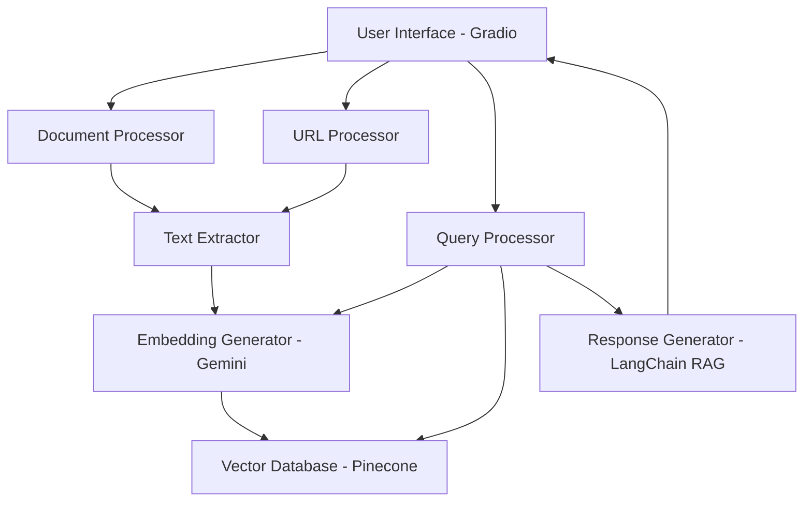
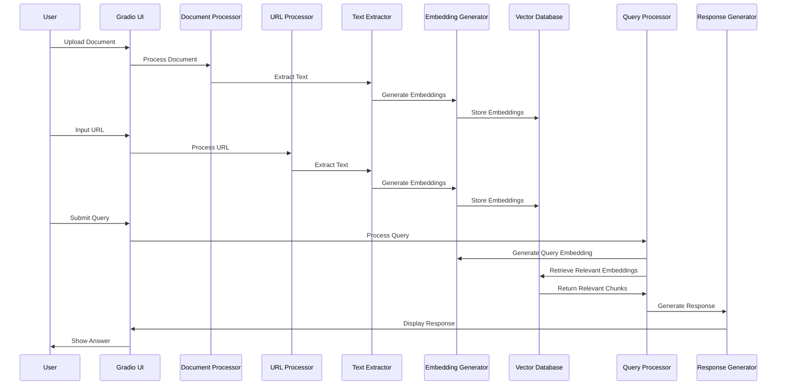
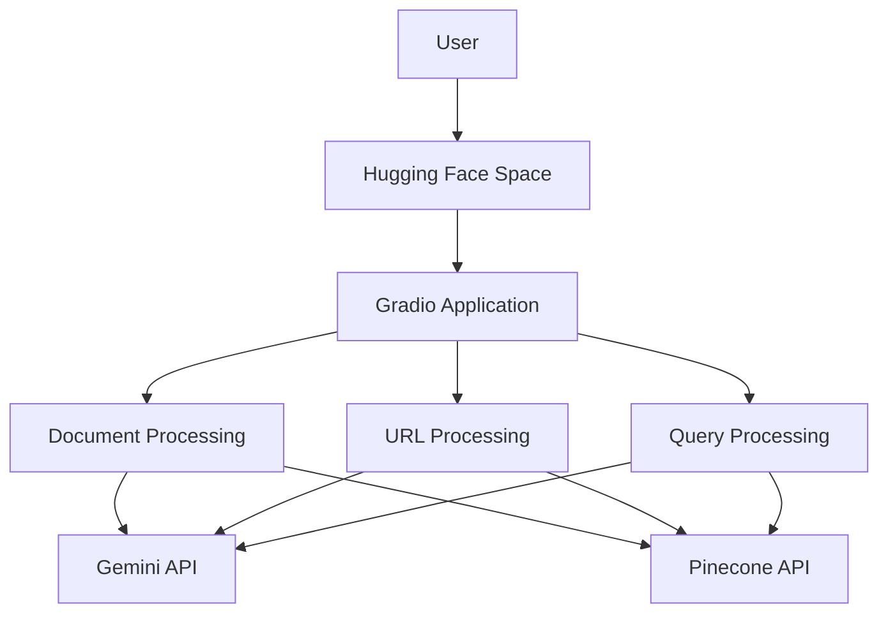

# AI Embedded Knowledge Agent - Architecture Document

## 1. System Overview

The AI Embedded Knowledge Agent is a versatile knowledge management system designed to ingest, process, and retrieve information from various document types and web sources. Built for a hackathon and deployable on Hugging Face, this system enables users to upload documents or provide URLs, which are then processed, embedded, and stored for intelligent retrieval.



## 2. Core Components

### 2.1 Document Ingestion System

This component handles the intake of various document formats and web content.

#### Document Processor

- **Responsibility**: Process uploaded documents (PDF, DOCX, CSV, PPTX, Excel)
- **Technologies**: PyMuPDF, python-docx, pandas, python-pptx, pdfplumber
- **Input**: Raw document files
- **Output**: Extracted text content

#### URL Processor

- **Responsibility**: Crawl and extract content from provided URLs, including nested documents and links
- **Technologies**: BeautifulSoup, requests, trafilatura
- **Input**: URLs
- **Output**: Extracted text content from web pages and linked documents

### 2.2 Knowledge Processing System

This component transforms raw text into queryable knowledge.

#### Text Extractor

- **Responsibility**: Clean, normalize, and chunk text from various sources
- **Technologies**: NLTK, spaCy, regex
- **Input**: Raw text from documents and web pages
- **Output**: Cleaned, normalized text chunks ready for embedding

#### Embedding Generator

- **Responsibility**: Generate vector embeddings for text chunks
- **Technology**: Gemini Embedding v3 (gemini-embedding-exp-03-07)
- **Input**: Processed text chunks
- **Output**: Vector embeddings

### 2.3 Knowledge Storage System

This component manages the storage and retrieval of vector embeddings.

#### Vector Database

- **Responsibility**: Store and index vector embeddings for efficient retrieval
- **Technology**: Pinecone
- **Input**: Vector embeddings with metadata
- **Output**: Retrieved relevant vectors based on similarity

### 2.4 Query Processing System

This component handles user queries and generates responses.

#### Query Processor

- **Responsibility**: Process user queries and convert them to vector embeddings
- **Technologies**: Gemini Embedding v3, LangChain
- **Input**: User queries
- **Output**: Query vector embeddings

#### Response Generator

- **Responsibility**: Generate coherent responses based on retrieved knowledge
- **Technology**: LangChain RAG (Retrieval Augmented Generation)
- **Input**: Retrieved relevant text chunks
- **Output**: Natural language responses

### 2.5 User Interface System

This component provides the user-facing interface.

#### Gradio UI

- **Responsibility**: Provide intuitive interface for document upload, URL input, and querying
- **Technology**: Gradio
- **Features**:
  - Document upload area
  - URL input field
  - Query input and response display
  - System status indicators

## 3. Data Flow



## 4. Technical Architecture

### 4.1 Technology Stack

| Component          | Technology                                            | Purpose                                    |
| ------------------ | ----------------------------------------------------- | ------------------------------------------ |
| Document Parsing   | PyMuPDF, python-docx, pandas, python-pptx, pdfplumber | Extract text from various document formats |
| Web Scraping       | BeautifulSoup, requests, trafilatura                  | Extract content from web pages             |
| Text Processing    | NLTK, spaCy, regex                                    | Clean and chunk text                       |
| Embedding          | Gemini Embedding v3 (gemini-embedding-exp-03-07)      | Generate vector embeddings                 |
| Vector Storage     | Pinecone                                              | Store and retrieve vector embeddings       |
| RAG Implementation | LangChain                                             | Implement retrieval augmented generation   |
| User Interface     | Gradio                                                | Provide user-friendly interface            |

### 4.2 Integration Points

- **Document Processing → Text Extraction**: Raw text extraction from documents
- **URL Processing → Text Extraction**: Raw text extraction from web pages
- **Text Extraction → Embedding Generation**: Processed text chunks for embedding
- **Embedding Generation → Vector Database**: Storage of embeddings
- **Query Processing → Embedding Generation**: Query embedding generation
- **Query Processing → Vector Database**: Retrieval of relevant embeddings
- **Query Processing → Response Generation**: Generation of coherent responses
- **Response Generation → UI**: Display of responses to user

## 5. Deployment Architecture

The system is designed to be deployed on Hugging Face using their Spaces feature, which supports Gradio applications.



### 5.1 Deployment Considerations

- **API Keys**: Secure storage of Gemini and Pinecone API keys
- **Rate Limiting**: Handling API rate limits for both Gemini and Pinecone
- **Memory Management**: Efficient memory usage within Hugging Face constraints
- **Statelessness**: Designing components to be stateless where possible
- **Error Handling**: Robust error handling for API failures and timeouts

## 6. Scalability and Performance

For the hackathon version, the focus is on functionality rather than scalability. However, the architecture is designed with the following considerations:

- **Document Size Limits**: Implement reasonable limits on document sizes
- **Chunking Strategy**: Optimize text chunking for better retrieval performance
- **Caching**: Implement basic caching for frequently accessed embeddings
- **Asynchronous Processing**: Use asynchronous processing where appropriate

## 7. Future Enhancements

While not implemented in the hackathon version, the architecture supports future enhancements:

- **Authentication**: User authentication and document access control
- **Document Versioning**: Track changes to documents over time
- **Advanced RAG Techniques**: Implement more sophisticated RAG approaches
- **Multi-Modal Support**: Add support for images and other non-text content
- **Collaborative Features**: Allow multiple users to collaborate on knowledge bases
- **Custom Training**: Fine-tune models for specific domains

## 8. Folder Structure

```
rag-ai/
├── src/
│   ├── ingestion/
│   │   ├── document_processor.py
│   │   ├── url_processor.py
│   │   └── text_extractor.py
│   ├── embedding/
│   │   └── embedding_generator.py
│   ├── storage/
│   │   └── vector_db.py
│   ├── rag/
│   │   ├── query_processor.py
│   │   └── response_generator.py
│   ├── ui/
│   │   └── gradio_app.py
│   └── utils/
│       ├── config_manager.py
│       └── error_handler.py
├── config/
│   └── config.yaml
├── docs/
│   ├── architecture.md
│   └── api_documentation.md
├── tests/
│   ├── test_document_processor.py
│   ├── test_url_processor.py
│   └── ...
├── scripts/
│   ├── setup.py
│   └── deploy_to_huggingface.py
├── data/
│   ├── sample_documents/
│   └── test_data/
├── .gitignore
├── requirements.txt
├── README.md
└── app.py
```

## 9. Implementation Roadmap

1. **Phase 1: Core Infrastructure**

   - Set up project structure
   - Implement basic document processing
   - Set up Pinecone integration

2. **Phase 2: Knowledge Processing**

   - Implement text extraction and chunking
   - Integrate Gemini embedding API
   - Develop vector storage and retrieval

3. **Phase 3: Query System**

   - Implement query processing
   - Develop RAG response generation
   - Integrate components

4. **Phase 4: User Interface**

   - Develop Gradio UI
   - Integrate UI with backend components
   - Add error handling and user feedback

5. **Phase 5: URL Processing**

   - Implement URL crawling
   - Add nested document extraction
   - Integrate with existing components

6. **Phase 6: Testing and Deployment**
   - Comprehensive testing
   - Optimization for Hugging Face deployment
   - Documentation and demo preparation
